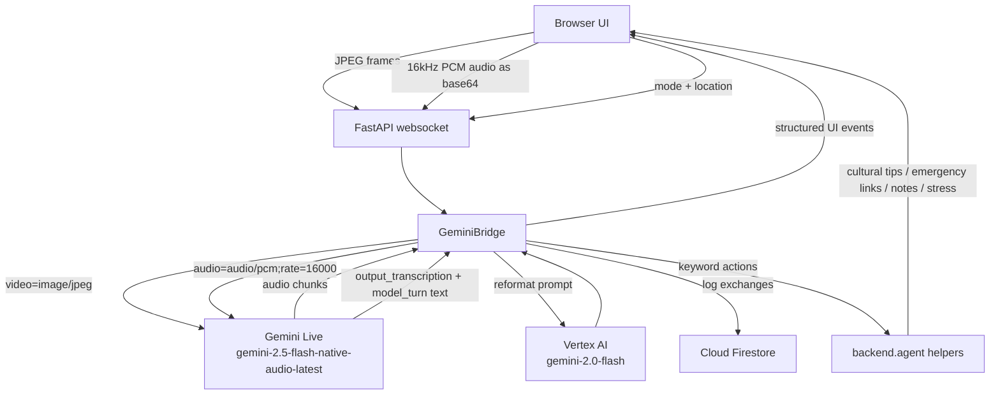

# ToneLens

> Google Translate tells you the words. ToneLens tells you the truth.

ToneLens is a real-time emotional intelligence web app built for the Gemini Live Agent Challenge 2026. It watches a conversation through the browser camera, listens to live audio, streams both to Gemini Live, reformats the model output into a strict UI-friendly structure, and surfaces translation, emotion, subtext, tactical suggestions, agent actions, history, and audio playback in one interface.

Live URL: [https://tonelens-z2mk33hdtq-uc.a.run.app](https://tonelens-z2mk33hdtq-uc.a.run.app)

## What Is In The Code

The current app implements:

- FastAPI routes for `/`, `/app`, `/about`, `/health`, and `/api/history/{session_id}`.
- A WebSocket endpoint at `/ws/{session_id}` for live camera, microphone, mode, and location streaming.
- A Gemini Live bridge using `gemini-2.5-flash-native-audio-latest` with `response_modalities=["AUDIO"]`.
- A second-pass formatter using Vertex AI `gemini-2.0-flash` to coerce live output into strict labeled lines.
- Four user modes: travel, meeting, present, negotiate.
- Keyword-driven agent actions for cultural tips, emergency help, meeting-note capture, and stress reporting.
- Firestore-backed session history and meeting notes.
- A vanilla HTML/CSS/JS frontend with live camera, live microphone, stress graph, history sidebar, meeting-notes sidebar, negotiation power balance, score ring, whisper coach, transcript feed, and real-time audio playback.

## Routes

From `backend/main.py`:

- `GET /` serves `frontend/landing.html`
- `GET /app` serves `frontend/index.html`
- `GET /about` serves `frontend/about.html`
- `GET /health` returns a JSON health payload
- `GET /api/history/{session_id}` returns the last 10 exchanges for a Firestore session
- `WS /ws/{session_id}` handles realtime frontend traffic

## Architecture



## Realtime Pipeline

What the running code does:

1. The frontend opens `WS /ws/{session_id}`.
2. The backend creates a Firestore session and initializes `GeminiBridge`.
3. Audio is queued in `main.py` until the live session is ready, then drained to Gemini.
4. Frames are throttled to one every 2 seconds and sent as JPEG blobs.
5. Audio is base64-decoded server-side and sent as raw PCM bytes with `mime_type="audio/pcm;rate=16000"`.
6. Gemini Live returns audio plus transcript text via `server_content.output_transcription` and/or `model_turn.parts`.
7. The bridge accumulates transcript text until `turn_complete`.
8. The raw text is reformatted through Vertex AI `gemini-2.0-flash`.
9. The structured response is parsed into translation, emotion, subtext, suggestion, and negotiation power.
10. Exchanges are stored in Firestore and keyword actions may trigger extra UI panels.

## Modes

The live prompts in `backend/gemini_bridge.py` define four actual operating modes:

- `travel`: translation, emotion, subtext, suggestion
- `meeting`: same four-line structure, plus meeting-note capture and screen-audio workflow in the frontend
- `present`: filler-word detection, pace analysis, and coaching tips
- `negotiate`: translation, emotion, tactical subtext, power score, and negotiation suggestion

## Agent Helpers

The runtime helper functions in `backend/agent.py` are:

- `search_cultural_context(language, phrase)`
- `find_emergency_services(situation, latitude, longitude)`
- `save_meeting_note(session_id, key_point, speaker_emotion)`
- `get_stress_report(session_id)`

Important implementation detail: the bridge explicitly notes that Gemini Live function declarations are omitted for this model/config, so these helpers are triggered by keyword logic in `GeminiBridge._run_keyword_actions`, not by live tool-calling.

## Frontend Features

From `frontend/index.html`, the app currently includes:

- Home link and mode switcher
- Connection status dot and label
- Live camera panel with emotion badge overlay
- Camera-denied error state with `[ RETRY ]`
- Emotion meter
- Stress tracker chart
- Live microphone waveform and status
- Translation card
- Cultural tip card
- Emotional context card
- Suggestion card
- Negotiation-only power balance, score ring, whisper coach, and momentum chart
- Agent actions card
- Transcript card
- History sidebar
- Meeting notes sidebar with export
- Emergency overlay with hospital, police, and `Call 112`

## Tech Stack

From the code and dependency files:

- Backend: FastAPI, Uvicorn, Python
- AI SDK: `google-genai`
- Realtime transport: WebSockets
- Persistence: `google-cloud-firestore`
- Environment loading: `python-dotenv`
- Frontend: vanilla HTML, CSS, JavaScript
- Charts: Chart.js
- Container: Docker
- Deployment target: Google Cloud Run
- Image registry path in deploy script: Artifact Registry in `us-central1`

Python dependencies from `backend/requirements.txt`:

- `fastapi`
- `uvicorn[standard]`
- `google-genai`
- `google-adk`
- `google-cloud-firestore`
- `python-dotenv`
- `websockets`
- `python-multipart`
- `aiofiles`
- `pydantic`

## Project Structure

```text
backend/
  agent.py
  gemini_bridge.py
  main.py
  session_manager.py
  requirements.txt
frontend/
  landing.html
  about.html
  index.html
Dockerfile
deploy.sh
README.md
```

## Local Setup

### Prerequisites

- Python installed locally
- `gcloud` installed and authenticated
- Application Default Credentials for Firestore and Vertex AI access
- A valid `GOOGLE_API_KEY` for Gemini Live

### Environment Variables

The code reads these values directly:

- `GOOGLE_API_KEY`: required for the Gemini Live session client
- `GOOGLE_CLOUD_PROJECT`: used by the bridge and Vertex AI/Firestore integrations
- `GOOGLE_CLOUD_REGION`: used by deployment and Vertex AI client setup
- `PORT`: used by the container runtime, default `8080`

Example `.env`:

```env
GOOGLE_API_KEY=your_google_ai_studio_key
GOOGLE_CLOUD_PROJECT=notional-cirrus-458606-e0
GOOGLE_CLOUD_REGION=us-central1
```

### Install And Run

```bash
python -m venv .venv
. .venv/bin/activate
pip install -r backend/requirements.txt
gcloud auth application-default login
uvicorn backend.main:app --reload --port 8080
```

Open:

```text
http://localhost:8080
```

## Deployment

There are two deployment paths in the repo.

### 1. Source deploy

The project has been deployed with:

```bash
gcloud run deploy tonelens --source . --region us-central1 --project notional-cirrus-458606-e0
```

### 2. Docker + Artifact Registry deploy

`deploy.sh` does the following:

1. Sets project `notional-cirrus-458606-e0`
2. Ensures Artifact Registry repo `tonelens-repo` exists
3. Builds `us-central1-docker.pkg.dev/notional-cirrus-458606-e0/tonelens-repo/app:latest`
4. Pushes the image
5. Deploys to Cloud Run with:
   - region `us-central1`
   - memory `2Gi`
   - cpu `2`
   - min instances `0`
   - max instances `5`
   - port `8080`

Important: `deploy.sh` sets `GOOGLE_CLOUD_PROJECT` and `GOOGLE_CLOUD_REGION`, but it does not inject `GOOGLE_API_KEY`. For a fresh deployment, that key must already exist in the service config or be supplied separately.

## Docker Image

From `Dockerfile`:

- Base image: `python:3.11-slim`
- Working directory: `/app`
- Installs `backend/requirements.txt`
- Copies `backend/` and `frontend/`
- Exposes port `8080`
- Runs:

```bash
uvicorn backend.main:app --host 0.0.0.0 --port 8080 --workers 1 --log-level info
```

## Firestore Storage

From `backend/session_manager.py`:

- New sessions are created in the `sessions` collection
- Each session stores:
  - `created_at`
  - `mode`
  - `exchanges`
- Exchanges append:
  - `timestamp`
  - `translation`
  - `emotion`
  - `subtext`
  - `suggestion`

Meeting notes are stored under:

- `sessions/{session_id}/notes/{note_id}`

## Builder

From the app content itself:

- Name: Mohan Prasath
- Age: 18
- Location: Chennai, India
- Education: B.Tech CSE (AI & ML)

## Why This Build Stands Out

ToneLens is not a static demo site. The current codebase already ships a real multimodal loop:

- browser camera and mic capture
- live WebSocket transport
- Gemini Live audio-only response flow
- structured second-pass reasoning format
- Firestore session memory
- emergency and cultural-action side effects
- mobile-optimized landing, about, and app pages

This repo is already in a shape where a judge can open the landing page, launch the app, grant camera/mic access, and see a working multimodal interaction pipeline.

## License

See `LICENSE`.
