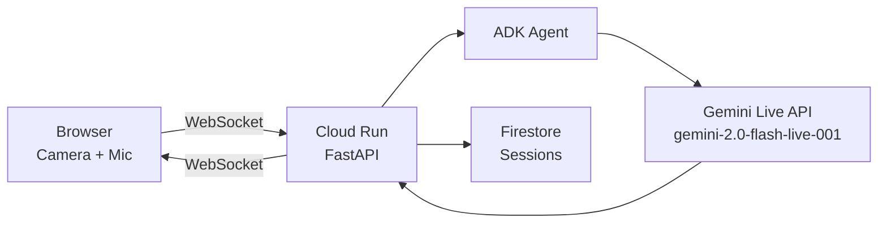

# ToneLens 🌍

> Google Translate tells you the words. ToneLens tells you the truth.

Real-time emotional translation agent built for the Google Gemini Live Agent Challenge 2026.

## What it does

ToneLens watches any conversation through your camera, listens through your microphone, and instantly tells you:

- **What language they're speaking** + translation
- **What emotion they're showing** (with confidence %)
- **What they actually mean** (cultural + emotional subtext)
- **How you should respond**

All streamed live. All spoken back to you in real-time.

## Architecture



## Tech Stack

| Component | Technology |
|---|---|
| AI Model | Gemini Live API (`gemini-2.0-flash-live-001`) |
| Agent Framework | Google ADK (Agent Development Kit) |
| AI SDK | Google GenAI SDK |
| Backend | FastAPI + WebSockets (Python) |
| Hosting | Google Cloud Run |
| Database | Google Cloud Firestore |
| Frontend | Vanilla JavaScript (single HTML file) |

## Local Setup

### Prerequisites

- Python 3.11+
- Google Cloud SDK installed and authenticated
- GCP project with Vertex AI and Firestore enabled

### Steps

1. **Clone the repo**

   ```bash
   git clone https://github.com/mohanprasath-dev/tonelens
   cd tonelens
   ```

2. **Install dependencies**

   ```bash
   pip install -r backend/requirements.txt
   ```

3. **Set up credentials**

   ```bash
   cp .env.example .env
   gcloud auth application-default login
   ```

4. **Run locally**

   ```bash
   uvicorn backend.main:app --reload --port 8080
   ```

5. **Open browser**

   ```
   http://localhost:8080
   ```

## Deploy to Cloud Run

```bash
bash deploy.sh
```

Or use Cloud Build:

```bash
gcloud builds submit --config cloudbuild.yaml
```

## Environment Variables

| Variable | Description | Required |
|---|---|---|
| `GOOGLE_CLOUD_PROJECT` | GCP Project ID | Yes |
| `GOOGLE_CLOUD_REGION` | GCP Region | Yes |
| `GOOGLE_APPLICATION_CREDENTIALS` | Path to service account JSON | Local only |
| `PORT` | Server port (default: 8080) | No |

## How It Works

1. **Camera** captures video frames every 2 seconds and sends them to the backend as base64 JPEG
2. **Microphone** streams audio continuously as base64 PCM (16-bit, 16kHz)
3. **Backend** receives frames and audio via WebSocket and forwards them to the Gemini Live API
4. **Gemini** analyzes the multimodal input and returns structured analysis:
   - Translation of detected speech
   - Emotion classification with confidence
   - Subtext interpretation with cultural context
   - Response suggestions tailored to the user's mode
5. **Results** are streamed back to the browser in real-time via WebSocket
6. **Sessions** are persisted in Firestore for history and analytics

## Modes

| Mode | Icon | Behavior |
|---|---|---|
| Travel | 🌍 | Warm, helpful suggestions for cross-cultural interactions |
| Meeting | 💼 | Strategic, professional suggestions for business contexts |
| Present | 🎤 | Audience engagement-focused suggestions for presentations |

## Built for

**Gemini Live Agent Challenge 2026**

`#GeminiLiveAgentChallenge`
