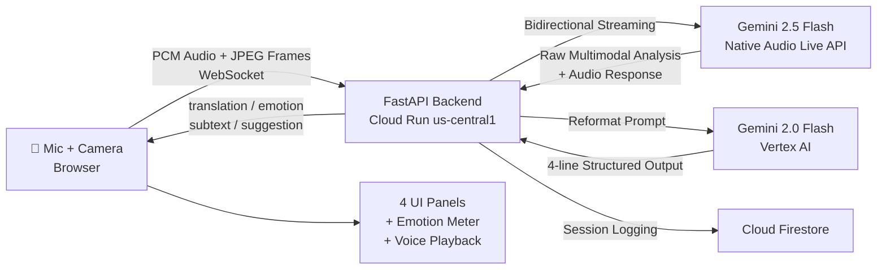

# ToneLens 🌍

> Google Translate tells you the words. ToneLens tells you the truth.

Real-time emotional translation agent built for the Google Gemini Live Agent Challenge 2026.

🔴 **Live Demo:** https://tonelens-1095027648976.us-central1.run.app

---

## What it does

ToneLens watches any conversation through your camera, listens through your microphone, and instantly tells you:

- **What language they're speaking** + translation to English
- **What emotion they're showing** (with confidence %)
- **What they actually mean** (cultural + emotional subtext)
- **How you should respond** — tailored to your context

All streamed live. All spoken back to you in real-time via Gemini's native audio.

---

## Architecture



---

## Tech Stack

| Component | Technology |
|---|---|
| Live AI Model | `gemini-2.5-flash-native-audio-latest` (Gemini Live API) |
| Reformat Model | `gemini-2.0-flash` (Vertex AI) |
| Agent Framework | Google ADK (Agent Development Kit) |
| AI SDK | Google GenAI SDK (`google-genai`) |
| Backend | FastAPI + WebSockets (Python 3.11) |
| Hosting | Google Cloud Run (us-central1) |
| Database | Google Cloud Firestore |
| Frontend | Vanilla JavaScript (single HTML file) |

---

## Modes

| Mode | Icon | Behavior |
|---|---|---|
| Travel | 🌍 | Real-time translation + cultural context for cross-language interactions |
| Meeting | 💼 | Screen audio capture + strategic suggestions for business conversations |
| Present | 🎤 | Filler word detection + pace analysis + coaching tips for speakers |

---

## Local Setup

### Prerequisites

- Python 3.11+
- Google Cloud SDK installed and authenticated
- GCP project with Vertex AI, Firestore, and Cloud Run enabled
- Google AI Studio API key (for Gemini Live API)

### Steps

1. **Clone the repo**

   ```bash
   git clone https://github.com/mohanprasath-dev/tonelens
   cd tonelens
   ```

2. **Install dependencies**

   ```bash
   pip install -r backend/requirements.txt
   ```

3. **Set up environment**

   ```bash
   cp .env.example .env
   # Edit .env with your credentials
   gcloud auth application-default login
   ```

4. **Run locally**

   ```bash
   uvicorn backend.main:app --reload --port 8080
   ```

5. **Open browser**

   ```
   http://localhost:8080
   ```

---

## Deploy to Cloud Run

```bash
gcloud run deploy tonelens \
  --source . \
  --region us-central1 \
  --allow-unauthenticated \
  --set-env-vars="GOOGLE_GENAI_USE_VERTEXAI=FALSE,GOOGLE_API_KEY=your_key,GOOGLE_CLOUD_PROJECT=your_project,GOOGLE_CLOUD_REGION=us-central1" \
  --memory=1Gi \
  --cpu=1 \
  --timeout=300 \
  --min-instances=1
```

---

## Environment Variables

| Variable | Description | Required |
|---|---|---|
| `GOOGLE_API_KEY` | Google AI Studio API key (for Gemini Live) | Yes |
| `GOOGLE_CLOUD_PROJECT` | GCP Project ID (for Vertex AI + Firestore) | Yes |
| `GOOGLE_CLOUD_REGION` | GCP Region (e.g. `us-central1`) | Yes |
| `GOOGLE_GENAI_USE_VERTEXAI` | Must be `FALSE` for Live API | Yes |
| `PORT` | Server port (default: `8080`) | No |

---

## How It Works

1. **Camera** captures video frames every 2 seconds → sent as base64 JPEG to backend
2. **Microphone** streams audio continuously → sent as base64 PCM (16-bit, 16kHz)
3. **Backend** forwards both to Gemini Live API via bidirectional streaming
4. **Gemini Live** analyzes multimodal input and returns:
   - Raw analysis text + native audio response
5. **Vertex AI** (`gemini-2.0-flash`) reformats raw analysis into strict 4-line structure:
   ```
   TRANSLATION: ...
   EMOTION: [word] - [XX]%
   SUBTEXT: ...
   SUGGEST: ...
   ```
6. **Frontend** parses structured output → populates 4 UI panels + emotion meter
7. **Audio** from Gemini is decoded and played back in real-time
8. **Firestore** logs every exchange for session history

---

## Agent Actions

ToneLens uses Google ADK with 4 tools:

| Tool | Action |
|---|---|
| `analyze_emotion` | Classifies emotion from face + voice |
| `get_cultural_context` | Provides language + cultural interpretation |
| `suggest_response` | Generates context-aware response suggestions |
| `log_exchange` | Persists exchanges to Firestore |

---

## Built for

**Gemini Live Agent Challenge 2026** — by Mohan Prasath, 18, Chennai 🇮🇳

`#GeminiLiveAgentChallenge`